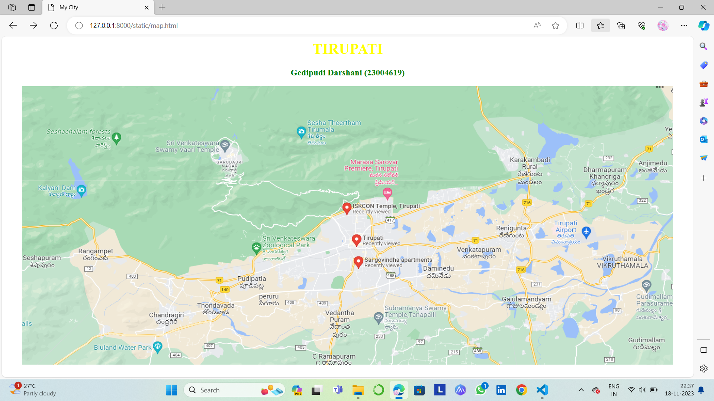
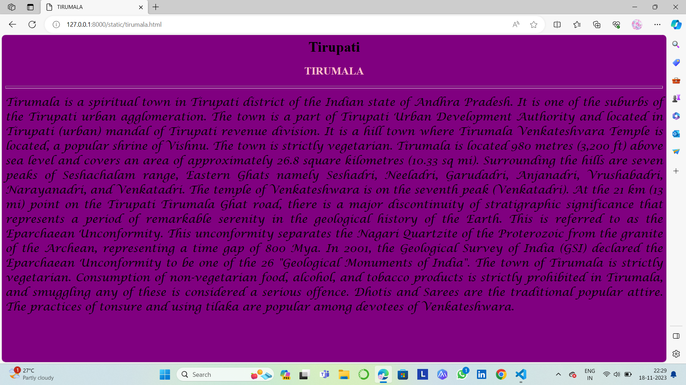
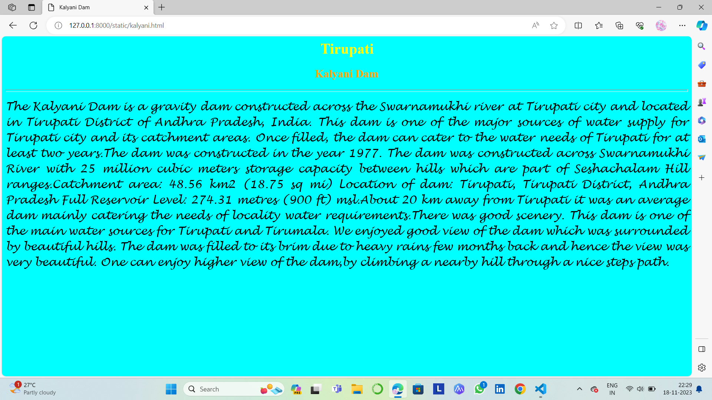
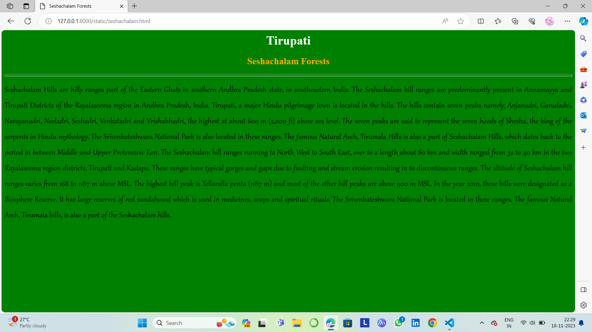
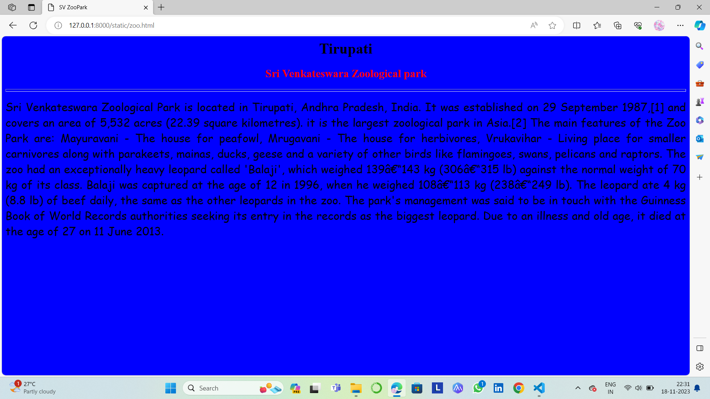

# Ex04 Places Around Me
## DATE:18-11-2023

## AIM
To develop a website to display details about the places around my house.

## DESIGN STEPS

### STEP 1
Create a Django admin interface.

### STEP 2
Download your city map from Google.

### STEP 3
Using ```<map>``` tag name the map.

### STEP 4
Create clickable regions in the image using ```<area>``` tag.

### STEP 5
Write HTML programs for all the regions identified.

### STEP 6
Execute the programs and publish them.

## CODE
```
map.html

<html>
<head>
<title>My City</title>
</head>
<body>
<h1 align ="center">
<font color="yellow"><b>TIRUPATI</b></font>
</h1>
<h3 align="center">
<font color="green"><b>Gedipudi Darshani (23004619)</b></font>       
</h3>
<center>

<map name="MyCity">
<area shape="circle" coords="420,160,30" href="tirumala.html" title="Tirumala">
<area shape="circle" coords="1200,320,50" href="airport.html" title="TIRUPATI Airport">
<area shape="circle" coords="160,250,50" href="kalyani.html" title="Kalyani Dam">
<area shape="circle" coords="500,340,30" href="zoo.html" title="Zoo Park">
<area shape="circle" coords="200,140,50" href="seshachalam.html" title="Sechachalam Forests">
</map>
</center>
</body>
</html>

tirumala.html

<html>
<head>
<title>TIRUMALA</title>
</head>
<body bgcolor="purple">
<h1 align="center">
<font color="black"><b>Tirupati</b></font>
</h1>
<h2 align="center">
<font color="pink"><b>TIRUMALA</b></font>   
</h2>
<hr size="6" colour="red">
<p align="justify">
<font face="Lucida Calligraphy" size="5">
    Tirumala is a spiritual town in Tirupati district of the Indian state of Andhra Pradesh. It is one of the suburbs of the Tirupati urban agglomeration. 
    The town is a part of Tirupati Urban Development Authority and located in Tirupati (urban) mandal of Tirupati revenue division.
     It is a hill town where Tirumala Venkateshvara Temple is located, a popular shrine of Vishnu. The town is strictly vegetarian.
     Tirumala is located 980 metres (3,200 ft) above sea level and covers an area of approximately 26.8 square kilometres (10.33 sq mi). Surrounding the hills are seven peaks of Seshachalam range, Eastern Ghats namely Seshadri, Neeladri, Garudadri, Anjanadri, Vrushabadri, Narayanadri, and Venkatadri. The temple of Venkateshwara is on the seventh peak (Venkatadri).
At the 21 km (13 mi) point on the Tirupati Tirumala Ghat road, there is a major discontinuity of stratigraphic significance that represents a period of remarkable serenity in the geological history of the Earth. This is referred to as the Eparchaean Unconformity. 
This unconformity separates the Nagari Quartzite of the Proterozoic from the granite of the Archean, representing a time gap of 800 Mya.

</font>
</p>
</body>
</html>


airport.html

<html>
<head>
<title>Tirupati Airport</title>
</head>
<body bgcolor="orange">
<h1 align="center">
<font color="cyan"><b>Tirupati</b></font>
</h1>
<h2 align="center">
<font color="blue"><b>Tirupati Airport</b></font>   
</h2>
<hr size="6" colour="green">
<p align="justify">
<font face="Comic Sans MS" size="5">
    Tirupati Airport is a domestic airport serving Tirupati, Andhra Pradesh. It is situated in Renigunta, a suburb of Tirupati. 
    It is 2.8 km away from National Highway 71 (previously NH-205),16 km  from Tirupati and 39 km (24 mi) from Venkateswara Temple, Tirumala.
    The airport was commissioned in 1971. In 1993, the then Prime Minister of India, P. V. Narasimha Rao, laid the foundation stone for a new terminal building, runway expansion and an Air Traffic Control (ATC) tower at a cost of ₹110 million (US$1.4 million). 
    The upgraded airport was opened for passenger traffic in 1999 by the then Prime Minister of India, Atal Bihari Vajpayee.
The airport was declared an international airport by the Government of India in June 2017. In order to meet the demands of the anticipated international traffic and international chartered flights, AAI took up expansion of the airport to make it suitable for Code-E type of aircraft. The then Vice President of India, Venkaiah Naidu, laid the foundation stone for the project on 20 February 2019. 
</font>
</p>
</body>
</html>

kalyani.html

<html>
<head>
<title>Kalyani Dam</title>
</head>
<body bgcolor="cyan">
<h1 align="center">
<font color="yellow"><b>Tirupati</b></font>
</h1>
<h2 align="center">
<font color="orange"><b>Kalyani Dam</b></font>   
</h2>
<hr size="6" colour="purple">
<p align="justify">
<font face="Lucida Handwriting" size="5">
    The Kalyani Dam is a gravity dam constructed across the Swarnamukhi river at Tirupati city and located in Tirupati District of Andhra Pradesh, India. 
    This dam is one of the major sources of water supply for Tirupati city and its catchment areas. 
    Once filled, the dam can cater to the water needs of Tirupati for at least two years.The dam was constructed in the year 1977.
    The dam was constructed across Swarnamukhi River with 25 million cubic meters storage capacity between hills which are part of Seshachalam Hill ranges.Catchment area: 48.56 km2 (18.75 sq mi)
    Full Reservoir Level: 274.31 metres (900 ft) msl.About 20 km away from Tirupati it was an average dam mainly catering the needs of locality water requirements.There was good scenery.
    The dam was filled to its brim due to heavy rains few months back and hence the view was very beautiful.
    One can enjoy higher view of the dam,by climbing a nearby hill through a nice steps path.
</font>
</p>
</body>
</html>

zoo.html

<html>
<head>
<title>SV ZooPark</title>
</head>
<body bgcolor="blue">
<h1 align="center">
<font color="black"><b>Tirupati</b></font>
</h1>
<h2 align="center">
<font color="red"><b>Sri Venkateswara Zoological park</b></font>   
</h2>
<hr size="6" colour="violet">
<p align="justify">
<font face="Comic sans MS" size="5">
Sri Venkateswara Zoological Park is located in Tirupati, Andhra Pradesh, India.
It was established on 29 September 1987,[1] and covers an area of 5,532 acres (22.39 square kilometres).
 it is the largest zoological park in Asia.[2]
The main features of the Zoo Park are:
Mayuravani - The house for peafowl,
Mrugavani - The house for herbivores,
Vrukavihar - Living place for smaller carnivores along with parakeets, mainas, ducks, geese and a variety of other birds like flamingoes, swans, pelicans and raptors.
The zoo had an exceptionally heavy leopard called 'Balaji', which weighed 139–143 kg (306–315 lb) against the normal weight of 70 kg of its class. 
The park's management was said to be in touch with the Guinness Book of World Records authorities seeking its entry in the records as the biggest leopard. Due to an illness and old age, it died at the age of 27 on 11 June 2013.
</font>
</p>
</body>
</html>

seshachalam.html

<html>
<head>
<title> Seshachalam Forests</title>
</head>
<body bgcolor="green">
<h1 align="center">
<font color="white"><b>Tirupati</b></font>
</h1>
<h2 align="center">
<font color="orange"><b>Seshachalam Forests</b></font>   
</h2>
<hr size="6" colour="yellow">
<p align="justify">
<font face="Gabriola" size="5">
Seshachalam Hills are hilly ranges part of the Eastern Ghats in southern Andhra Pradesh state, in southeastern India.
 The Seshachalam hill ranges are predominantly present in Annamayya and Tirupati Districts of the Rayalaseema region in Andhra Pradesh, India.
Tirupati, a major Hindu pilgrimage town is located in the hills. 
The hills contain seven peaks namely, Anjanadri, Garudadri, Narayanadri, Neeladri, Seshadri, Venkatadri and Vrishabhadri, the highest at about 600 m (2,000 ft) above sea level. 
The seven peaks are said to represent the seven hoods of Shesha, the king of the serpents in Hindu mythology. 
The Srivenkateshwara National Park is also located in these ranges. The Seshachalam hill ranges running to North West to South East, over to a length about 80 km and width ranged from 32 to 40 km in the two Rayalaseema region districts, Tirupati and Kadapa.  
The highest hill peak is Tellaralla penta (1187 m) and most of the other hill peaks are above 900 m MSL.
In the year 2010, these hills were designated as a Biosphere Reserve. It has large reserves of red sandalwood which is used in medicines, soaps and spiritual rituals. 
The Srivenkateshwara National Park is located in these ranges. The famous Natural Arch, Tirumala hills, is also a part of the Seshachalam hills.
</font>
</p>
</body>
</html>
```

## OUTPUT







## RESULT
The program for implementing image maps using HTML is executed successfully.
